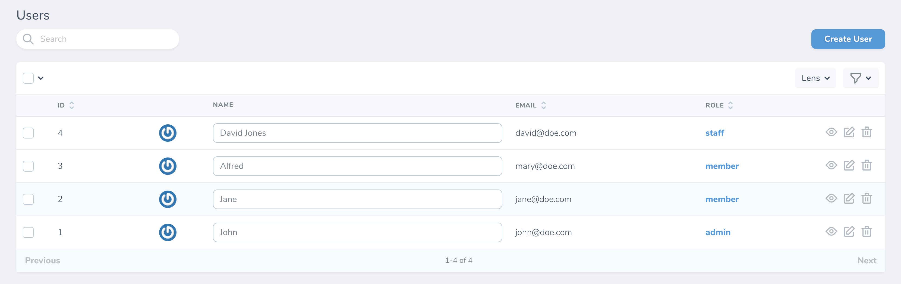

# Nova Inline Text

[](https://packagist.org/packages/pdmfc/nova-inline-text)


This package lets you edit text fields directly on your resources pages.

## Installation

```shell
composer require pdmfc/nova-inline-text
```

## Usage

```php
use Pdmfc\NovaFields\InlineText;

//...

public function fields()
{
    return [
        InlineText::make('Name'),
    ];
}
```

### Making it editable

By default this field behaves like a regular text field. To be able to edit it on the index page, use the `inlineOnIndex()` method:

```php
public function fields()
{
    return [
        InlineText::make('Name')
            ->inlineOnIndex(),
    ];
}
```



This method also accepts a closure with the current request if you want to make it editable dynamically:

```php
public function fields()
{
    return [
        InlineText::make('Name')
            ->inlineOnIndex(function (NovaRequest $request) {
                return $request->user()->isAdmin();
            }),
    ];
}
```

### Refreshing resource table

When saving the current field value, it will not refresh the table.
If you need this functionality, use the `refreshOnSaving()` method:

```php
public function fields()
{
    return [
        InlineText::make('Name')
            ->inlineOnIndex()
            ->refreshOnSaving(),
    ];
}
```

---

## How to contribute

- clone the repo
- on `composer.json` of a laravel nova application add the following:

```
{
    //...

    "require" {
        "pdmfc/nova-inline-text: "*"
    },

    //...
    "repositories": [
        {
            "type": "path",
            "url": "../path_to_your_package_folder"
        }
    ],
}
```

- run `composer update pdmfc/nova-inline-text`

You're now ready to start contributing!
